# Food Delivery App

A full-stack food delivery application where users can browse food items, add to cart, and place orders with Stripe payment integration.

# Live Demo

**Live Demo:** [tasty-me.netlify.app](https://tasty-me.netlify.app)

# Stack Used

- **Frontend**: Next.js, TypeScript, Tailwind CSS
- **Backend**: Node.js, Express, MongoDB, JWT
- **Payment**: Stripe
- **Deployment**: Netlify (frontend), Render (backend)
- **Database**: MongoDB Atlas

# UI Desktop views
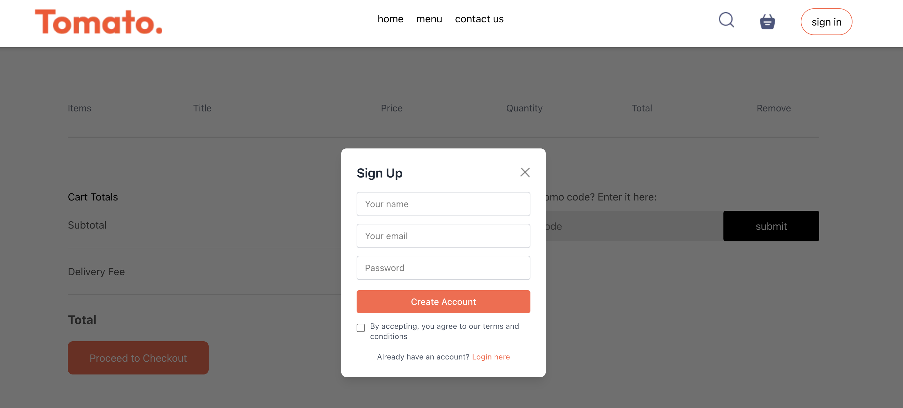
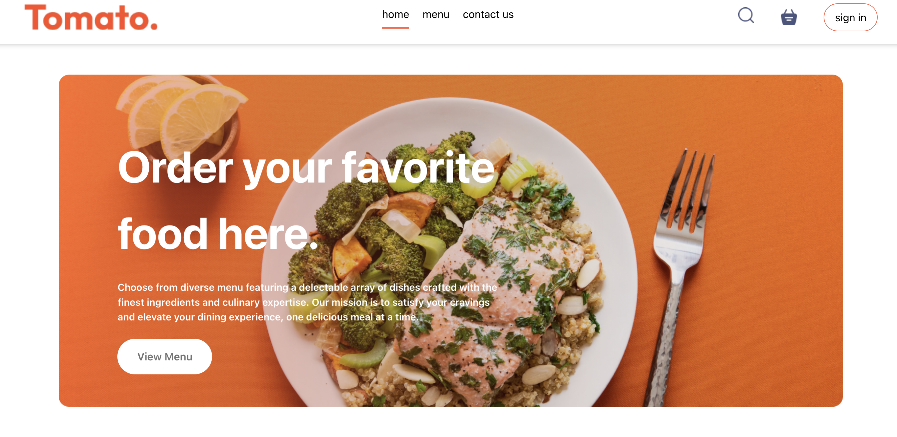
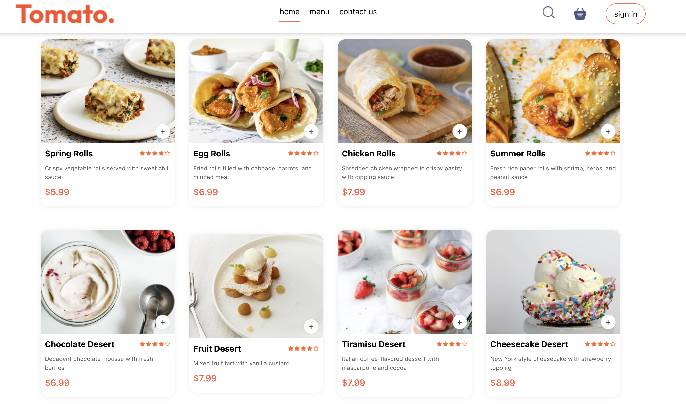
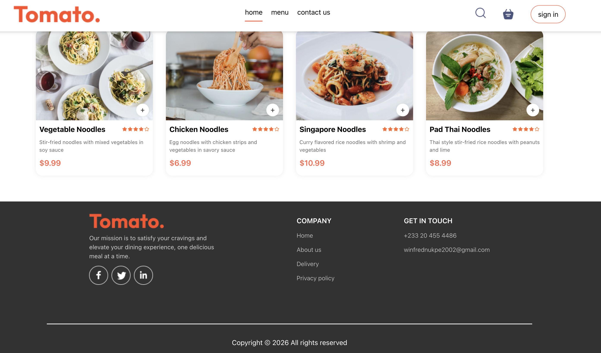
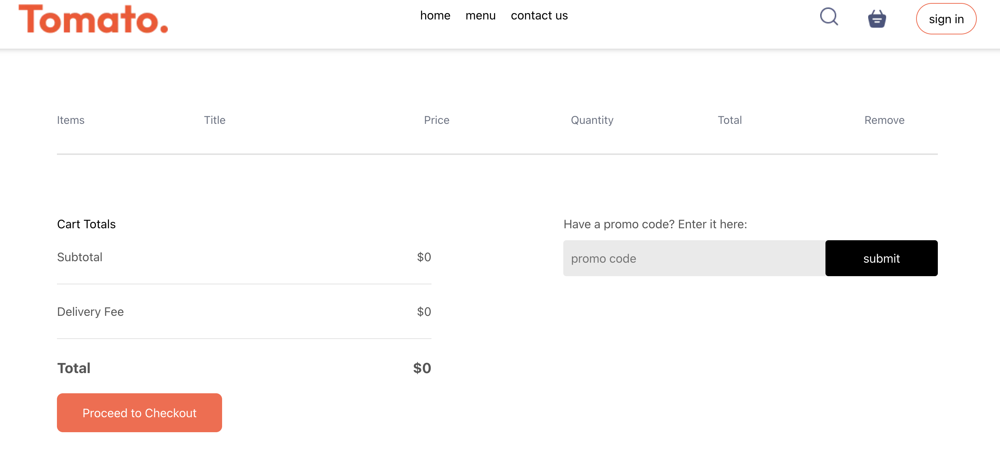

# UI Mobile views
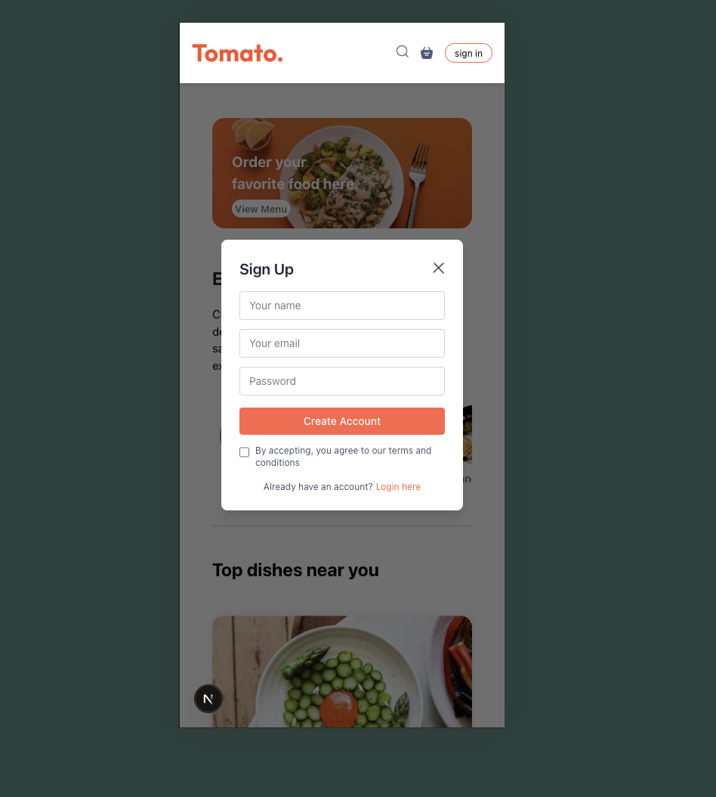
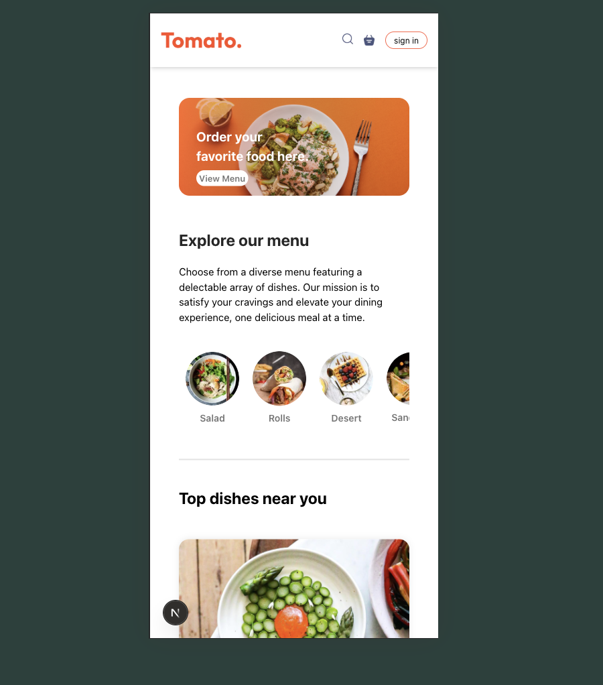
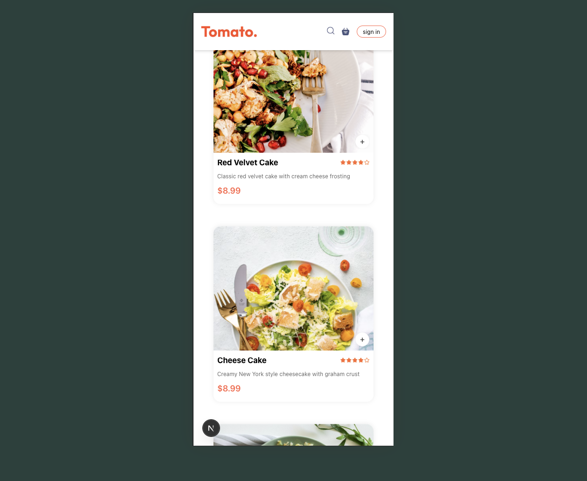
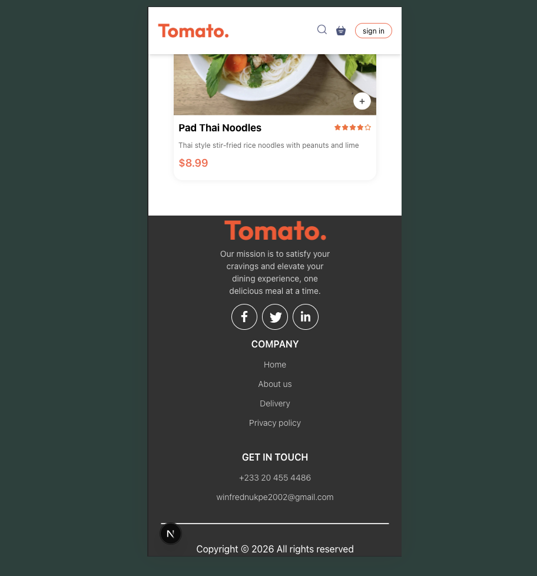

# Admin Panel UI
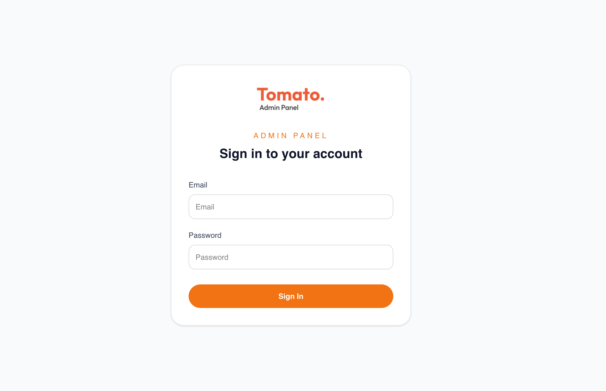
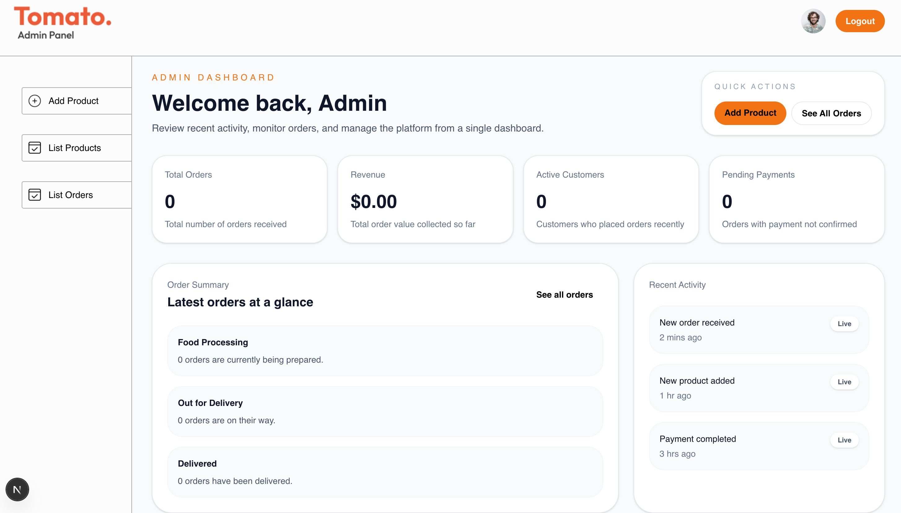
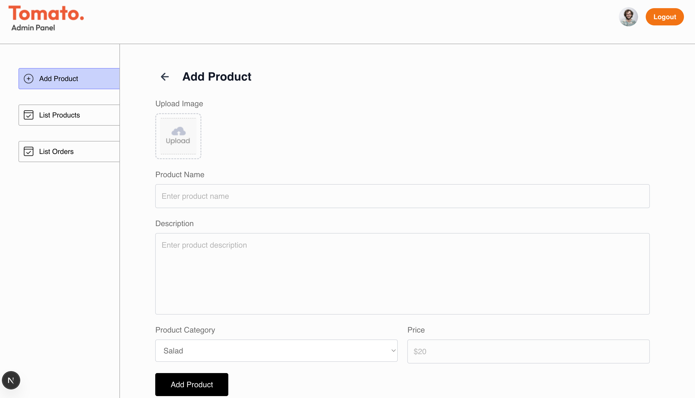
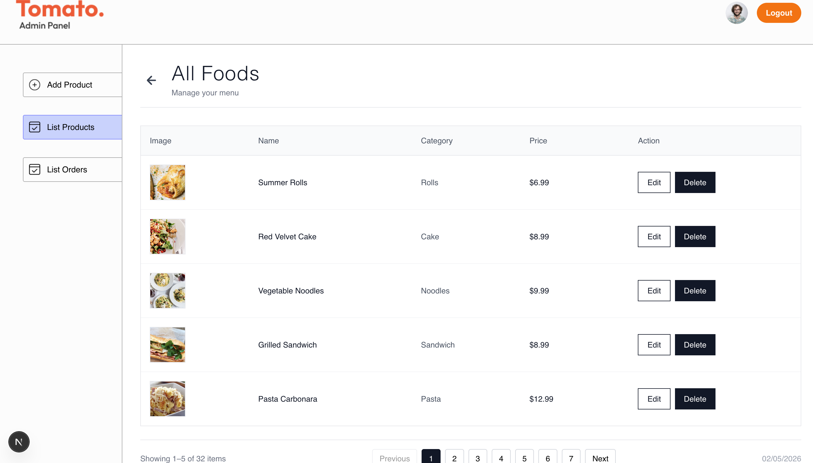
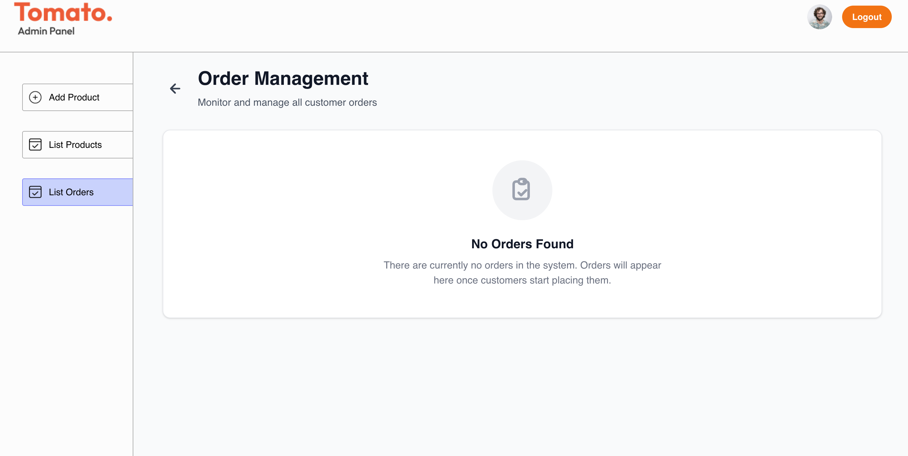

